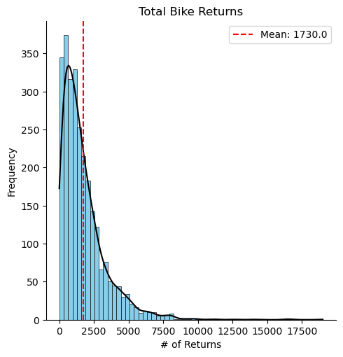
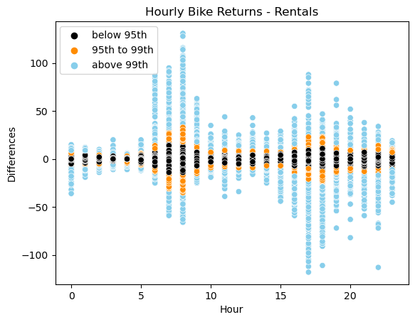
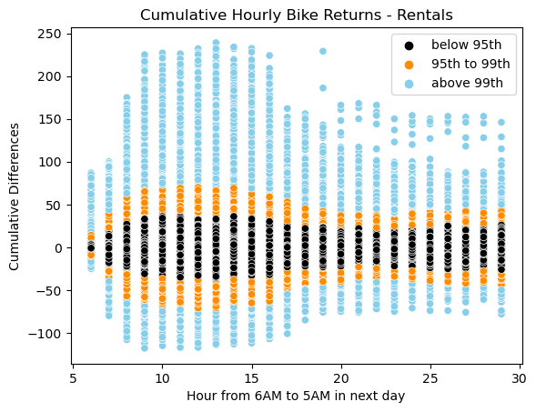

# **Seoul City Public Bike Rental System Analysis**

This project analyzes a real-world dataset of a public bike rental system in Seoul City, applying quantitative methods to estimate supply and demand at each rental station. The ultimate goal is to minimize bike shortages across the city and optimize the allocation process. For more information on the bike rental system, visit [https://www.bikeseoul.com/](https://www.bikeseoul.com/)

---

## **Table of Contents**
1. [Data](#Data)
2. [EDA](#EDA)
3. [Modeling](#Modeling)
4. [Results](#Results)
5. [Future Studies](#Future-Studies)

---

## **Data**
The real-world datasets on bike rental history and rental station information are published quarterly on Seoul City's open data portal, [data.seoul.go.kr](https://data.seoul.go.kr/). For this project, we use monthly data from June 2024.

### **Bike Rental History Data:**
- **Description**: Contains 5,004,330 records of bike rental transactions.
- **Variables**:
  - Bike IDs, timestamps of bike rentals and returns.
  - Station IDs for rentals and returns.
  - User information (e.g., birth year, sex).
  - Used meters, minutes, etc.
- **Example**: Bike ID `spb-66298` was rented on 2024-06-01 00:02:11 from station ID `ST-2822` and returned on 2024-06-01 00:03:55 to station `ST-1653` by a female domestic user born in 1990.

### **Rental Station Master Data:**
- **Description**: Contains information on 3,340 available bike rental stations.
- **Variables**:
  - Station IDs, addresses, latitude, and longitude.
- **Example**: Station ID `ST-99` is located at latitude 37.53186, longitude 127.067192, with an address of '10, Neungdong-ro, Gwangjin-gu, Seoul'.

In June 2024, the public bike rental system operated 39,197 unique bikes and 2,740 unique bike rental stations. Out of the 5,004,330 recorded transactions, 19,978 (0.4%) are missing bike return information, possibly due to software errors or unreturned bikes. These rows will be excluded from the analysis. Additionally, rides with 0 minutes of usage or 0 meters traveled will be removed, as these likely indicate improper usage. After applying these filters, 4,740,293 rows remain, representing 94.7% of the original dataset, which will be used for the analysis.

---

## **EDA**

### **Key Insights:**
- **Daily Patterns**: Peak rental and return times occur at 8 AM and 6 PM, aligning with commuting hours, and demand is higher on weekdays.
- **Geographic Distribution**: Bike demand varies significantly across the city, with higher demand in central areas where many corporate offices are located, as well as near parks along the Han River.
- **Correlations**: Hourly rentals and returns are strongly positively correlated, and past demand is also highly correlated with current demand.
- **Skewness**: A small number of stations experience extremely high demand. Accurately predicting these extreme cases will be key to optimizing the allocation process and minimizing the risk of bike shortages at stations.

### **Visualizations:**
- **Distributions and Correlations:**

  

 - The total number of bike rentals for each station in June 2024 follows a Poisson distribution, with a mean of approximately 1,733.8 rentals.

 
 
 

  

 - Similarly, the total number of bike returns for each station follows a Poisson distribution, with a mean of approximately 1,730.0 returns.

 
 
 

  

 - Bike rentals and returns, which represent supply and demand respectively, are strongly positively correlated.

 
 
 

  

 - Bike rentals are higher on weekdays than on weekends.

 
 
 

- **Daily Patterns:**

  

- Data points are color-coded based on the percentile ranges for each hour.

- The lower 95% of data points per hour are concentrated near the lower end, matching the pattern of Poisson distributions.

- The upper 5% of data per hour are right-skewed, with ranges varying by hour.

- Overall, bike rentals peak around 8 AM and 6 PM, with more pronounced spikes at specific stations on certain days.

 
 
 

  

 - Bike returns follow the same pattern as rentals.

 
 
 

  

 - Data points are color-coded based on the percentile ranges of the absolute difference between bike returns and rentals for each hour.

 - Positive differences indicate that more bikes were returned than rented, increasing the number of available bikes at the station for that hour. 

 - Negative differences indicate that more bikes were rented than returned, decreasing the number of bikes remaining at the station.

 - The discrepancies between rentals and returns are larger during peak hours around 8 AM and 6 PM, with more pronounced differences at stations with higher demand.

 
 
 

  

 - Data points are color-coded based on the percentile ranges of the absolute difference between cumulative bike returns and rentals for each hour, starting from 6 AM.

 - The differences between rentals and returns accumulate throughout the day, causing some stations to experience a shortage of bikes while others have an excess.

 
 
 

- **Geographic Distribution:**

Average bike rentals per station in June 2024:

 - Many parks and bike paths along the Han River contribute to high bike rental activity, particularly on the western and eastern sides of the city.

 - The city center, located north of the river, is a major business district where bike rentals are primarily driven by commuting.

 - The northeastern area, with its riverside parks and bike paths, also sees significant bike rental activity.

 
---

## **Modeling**
To predict the number of bike rentals and returns for each station, we will use a Generalized Additive Model (GAM) with a Poisson distribution. This model is appropriate for count data, as bike rentals and returns are discrete events that occur at specific times. The goal is to capture the non-linear relationships between the response variables (bike rentals and returns) and several predictors, including geographic location, time-related effects (such as day and hour), and historical data.

### **Model Structure:**
The Poisson GAM will be structured as follows:

$$
\log(\lambda) = \beta_0 + f_1(\text{latitude}, \text{longitude}) + f_2(\text{weekday}) + f_3(\text{hour}) + f_4(\text{weekday} \times \text{hour}) + f_5(\text{past rentals/returns})
$$

Where:
- $\lambda$ is the expected number of bike rentals or returns at each station on an hourly basis.
- $f_1(\text{latitude}, \text{longitude})$ is an interaction term that captures the non-linear impact of geographical location on bike rentals/returns.
- $f_2(\text{weekday})$ and $f_3(\text{hour})$ represent smooth functions to capture the periodic and seasonal effects of day and time.
- $f_4(\text{weekday} \times \text{hour})$ is an interaction term that captures any combined effects between the day of the week and hour of the day.
- $f_5(\text{past rentals/returns})$ accounts for rolling averages of bike rentals and returns over the past 7 days on an hourly basis, capturing both the inherent and recent demand for each station.

### **Variables:**
The key variables that will be included in the model are:

- **Geographical location (latitude and longitude):** The impact of a station's location on bike rentals and returns will be captured through an interaction term, modeled non-linearly. We anticipate that certain areas, such as city centers or locations near popular parks, will exhibit higher rental and return rates.

- **Time effects (day of the week and hour of the day):** Bike rentals and returns follow clear patterns depending on the time of day and day of the week. For instance, there are surges in demand during peak commuting hours (8 AM and 6 PM). We will use smooth functions for the day of the week and hour of the day to model these periodic patterns.

- **Past rentals/returns:** To account for the dynamics of past rental and return activity, we will incorporate 7-day rolling averages of both bike rentals and returns. This allows the model to capture the effects of recent trends in the availability of bikes and demand at each station. These rolling averages will also serve as a baseline model to compare the performance of the GAM.

The GAM model will be trained using data from the first three weeks of June 2024, and its performance will be evaluated on data from the last week of the month, which will serve as the test set. Splitting the data by time period mimics a realistic forecasting scenario, where future data (the test set) is not available during training. However, this approach may not fully utilize the entire dataset available, as it excludes the last week from the training process.

### **Baseline Model:**
As part of our modeling process, we will also implement a baseline model that uses the 7-day rolling average of past rentals and returns at each station on an hourly basis. This simple model will predict the number of rentals and returns based purely on historical data, without capturing more complex relationships between geography and time. We will compare the performance of the GAM model with this baseline model to evaluate the improvements achieved by incorporating the smooth functions and more sophisticated relationships.

---

## **Results**

### **Model Performance:**

| Model               | RMSE (All Data) | RMSE (Data Points > 40) |
|---------------------|-----------------|-------------------------|
| GAM Model           | `2.59`          | `18.35`                 |
| Baseline Model      | `2.83`          | `18.78`                 |

The GAM model scores a slightly better RMSE than the baseline model of the past 7-day rolling average of hourly bike rentals for each station. It also has better accuracy on instances with high demand, specifically those with more than 40 bike rentals per hour, which is our area of focus in practice. 

 

| Model               | Corr. to Actual | Corr. to Actual (> 40)  |
|---------------------|-----------------|-------------------------|
| GAM Model           | `0.838`         | `0.785`                 |
| Baseline Model      | `0.800`         | `0.808`                 |

Overall, the predictions of the GAM model have a stronger correlation to the actual data than the past 7-day rolling averages, but a weaker correlation to instances with more than 40 bike rentals per hour, indicating that there is room for improvement. 

### **Visualizations:**
- **Distributions and Correlations:**

  

 - The predictions follow a Poisson distribution, as anticipated.

 
 
 

  

 - The periodic patterns, with peaks at 8 AM and 6 PM, and the distributions within each hour, closely match the actual data.

 
 
 

  

 - The predictions are higher on weekdays than on weekends, as expected.

 
 
 

  

 - The higher the past rentals, the higher the predictions, with variances influenced by other signaling variables.

 
 
 

  

 - Data points are color-coded based on the percentile ranges of the absolute residuals.

 - There is a positive linear relationship between the predictions and the actual data. 

 - Most predictions fall within a reasonable error range, though underestimations are more frequent for larger values and overestimations for smaller ones, suggesting potential for improvement.

 
 
 

  

 - Data points are color-coded by percentile ranges of the absolute residuals.
 
 - Most predictions fall within a reasonable error range, though underestimations are more frequent for larger values and overestimations for smaller ones, suggesting potential for improvement.

 
 
 

Predictions for 6:00 PM on June 28, 2024:

 

 - Higher predictions are observed in areas where greater demand is expected.

 
 
 

Actual Data for 6:00 PM on June 28, 2024:

 

 - The actual data points show more fluctuation, while the predictions are more "smoothed," suggesting that overfitting is not clearly apparent.
 
 - Data points are color-coded using the same range as the map for the predictions.

---

## **Future Studies**

Using a similar approach, we can train another GAM model to predict bike returns for each station and estimate the accumulated change in the number of remaining bikes on an hourly basis. To improve the accuracy of these predictive models, additional data, such as daily weather conditions and demographic information, could be incorporated, and further hyperparameter tuning could be explored.

According to a 2023 [article](https://tbs.seoul.kr/news/newsView.do?typ_800=7&idx_800=3507701&seq_800=20500380), over a hundred staff members across eleven maintenance centers monitor bike availability in real-time and redistribute bikes from stations with excess supply to those in need, typically two to three times a day. Given the substantial resources dedicated to this operation, future studies will focus on determining the optimal initial number of bikes for each station to minimize shortages and balance discrepancies in bike availability across stations.